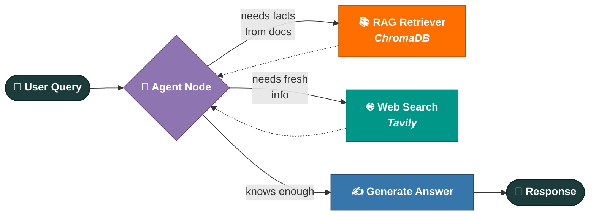

<div align="center">


<br/>

# 🦞 Clawbit

### An agent that reads, remembers, and reasons — so you don't have to.

<em>A LangGraph-native AI agent that decides for itself whether to search its memory, search the web, or just answer — built for developers who want an agent brain, not a chatbot wrapper.</em>

<br/>

[](https://www.python.org/)
[](https://fastapi.tiangolo.com/)
[](https://www.langchain.com/langgraph)
[](https://ai.google.dev/)
[](https://www.trychroma.com/)
[](./LICENSE)

<p>
  <a href="#-what-is-clawbit">Overview</a> •
  <a href="#-how-it-thinks">Architecture</a> •
  <a href="#-tech-stack">Tech Stack</a> •
  <a href="#-quickstart">Quickstart</a> •
  <a href="#-roadmap">Roadmap</a>
</p>

</div>

<br/>

## 🦖 What is Clawbit?

Clawbit is a small, sharp-clawed AI agent — a backend that **thinks in graphs, not scripts**.

Instead of a single prompt-in, text-out pipeline, Clawbit is built around **LangGraph**, meaning its reasoning is a *state machine*: the agent decides whether to search the web, dig through your documents, or answer directly — and that decision is a first-class node in the graph, not a hardcoded `if/else`.

Think of it less like a chatbot, and more like a tiny digital creature with three senses:

<div align="center">

</div>

<br/>

## 🧩 How It Thinks

The agent doesn't just *answer* — it **routes itself**. Every query is a decision tree Clawbit walks in real time, looping back to its own judgment node until it's confident enough to respond.



**Why this matters:** most "AI agent" projects are a single LLM call with a system prompt. Clawbit's control flow is an explicit, inspectable graph — every routing decision is a node you can log, test, and extend independently, and every conversation is checkpointed so the agent can resume mid-thought.

<br/>

## ⚙️ Tech Stack

<table>
<tr>
<th width="50%">🧠 Reasoning</th>
<th width="50%">🌐 Perception</th>
</tr>
<tr valign="top">
<td>

| Package | Role |
|---|---|
| `langchain` + `langgraph` | Agent orchestration & graph state |
| `langchain-google-genai` | Gemini as the reasoning engine |
| `langgraph-checkpoint-sqlite` | Persistent, resumable agent memory |

</td>
<td>

| Package | Role |
|---|---|
| `tavily-python` | Live web search |
| `langchain-tavily` | Search tool binding for the graph |

</td>
</tr>
<tr>
<th>📚 Knowledge</th>
<th>🚀 Body</th>
</tr>
<tr valign="top">
<td>

| Package | Role |
|---|---|
| `chromadb` + `langchain-chroma` | Vector storage & similarity search |
| `pypdf`, `docx2txt` | Document ingestion (PDF & Word) |
| `langchain-text-splitters` | Smart chunking |

</td>
<td>

| Package | Role |
|---|---|
| `fastapi` + `uvicorn` | API server |
| `jinja2` | HTML templating |
| `python-multipart` | File uploads |
| `sqlalchemy` | Database ORM |
| `python-dotenv` | Secrets, kept secret |

</td>
</tr>
</table>

<br/>

## 🗂️ Project Structure

```
Clawbit/
├── 🚀 app.py              FastAPI entry point — where requests land
├── 🧠 agent.py             The LangGraph brain: nodes, edges, decisions
├── 📚 rag.py               Document ingestion + retrieval pipeline
├── 🛠️  tool.py              Tools the agent is allowed to reach for
├── 🗄️  database.py          SQLAlchemy models & persistence layer
├── 🎨 templates/
│   └── index.html         The face Clawbit shows the world
├── 📦 requirements.txt     Everything Clawbit needs to come alive
└── 📖 README.md            You are here
```

> 🥚 **Current stage — pre-hatch.** The skeleton is fully drawn: `app.py`, `agent.py`, `rag.py`, `tool.py`, and `database.py` are scaffolded, wired for imports, and ready to be filled with logic. Watch the [Roadmap](#-roadmap) for hatch progress.

<br/>

## 🚀 Quickstart

<table>
<tr><td>

**1. Clone & enter**

```bash
git clone https://github.com/hassankadri/Clawbit.git
cd Clawbit
```

**2. Give it a home**

```bash
conda create -n clawbit python=3.11 -y
conda activate clawbit
```

**3. Feed it dependencies**

```bash
pip install -r requirements.txt
```

**4. Whisper it your secrets**

Create a `.env` file in the root — this file is git-ignored, keep it that way:

```env
GOOGLE_API_KEY=your_gemini_api_key
TAVILY_API_KEY=your_tavily_api_key
DATABASE_URL=your_database_connection_string
```

**5. Wake it up**

```bash
python app.py
```

Clawbit opens its eyes at **http://localhost:8000** 👀

</td></tr>
</table>

<br/>

## 🔐 A Note on Secrets

Clawbit keeps its secrets where they belong — in `.env`, never in Git.

- ✅ `.env` is listed in `.gitignore` and has never been committed — checked across full history
- 🔁 Rotate any key immediately if it's ever exposed, no exceptions
- 🔍 When in doubt: `git log -p | grep -i key` before you push

<br/>

## 🛣️ Roadmap

- [ ] Hatch `agent.py` — define the LangGraph nodes & routing logic
- [ ] Build the ingestion pipeline in `rag.py`
- [ ] Register real tools inside `tool.py`
- [ ] Wire up persistence in `database.py`
- [ ] Design the front end in `templates/index.html`
- [ ] Add tests, CI, and a Dockerfile for one-command deploys

<br/>

## 🤝 Contributing

Found a bug? Have an idea that would make Clawbit sharper? Open an [issue](https://github.com/hassankadri/Clawbit/issues) or send a pull request — every contribution helps this thing grow.

<br/>

<div align="center">

**Built with curiosity, caffeine, and a healthy respect for `.gitignore`.**

📄 Licensed under the terms in [LICENSE](./LICENSE)

<sub>⭐ If Clawbit's approach to agent design is useful to you, consider starring the repo.</sub>

</div>
